# Latihan 1 - Buat sebuah list sebanyak 5 elemen dengan nilai bebas

1. Mengakses list:

- Tampilkan elemen ke 3
- Ambil nilai elemen ke 2 sampai elemen ke 4
- Ambil elemen terakhir

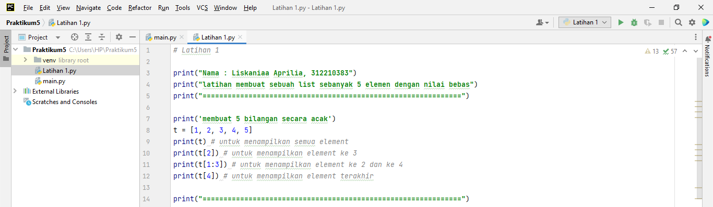

2.  Mengubah elemen list:

- Ubah elemen ke 4 dengan nilai lainnya
- Ubah elemen ke 4 sampai dengan elemen terakhir

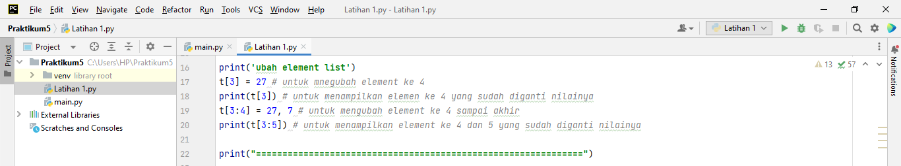

3. Menambah elemen list:

- Ambil 2 bagian dari list pertama (A) dan jadikan list ke 2 (B)
- Tambah list B dengan nilai string
- Tambah list B dengan 3 nilai
- Gabungkan list B dengan list A

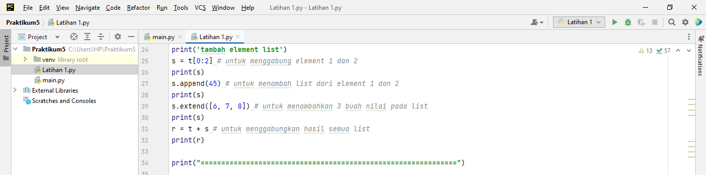

- Hasil dari program yang dijalankan :
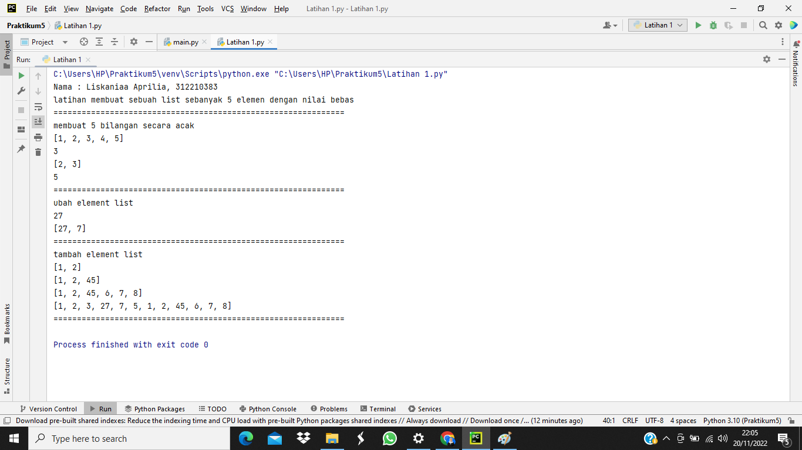

# Praktikum - membuat program sederhana untuk menambahkan data kedalam sebuah list

1. Memasukkan atau menambahkan data pada sebuah list, kita bisa menggunakan perintah append(), extend() tapi untuk program kali ini kita menggunakan perintah append(), karna kita akan menambahkan data satu persatu.

2. Pertama, buatlah sebuah variabel list kosong yang terdiri dari: nama=[], nim=[], tugas[], uts[], uas[], dan akhir[]. variabel list itu nanti yang akan diisi dengan menggukan perintah append(), dan juga jangan lupa untuk membuat variabel lanjut = 'ya' untuk perulangan while dan no = 0 untuk nomor pada output an nantinya

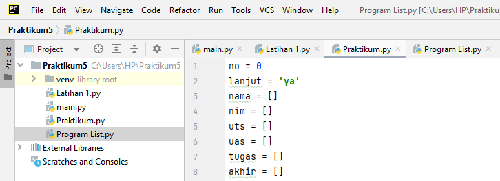

3. Cara untuk melakukan penambahan data pada variabel list yang sudah dibuat tadi adalah dengan menggunakan perulangan while supaya kita bisa menambahkan lebih dari satu kali atau satu data dan perulangan tersebut akan berakhir ketika kita mengetikkan tidak sama dengan y atau !='ya' dalam program (while lanjut == 'ya'), tetapi sebelum itu harus membuat inputan sebuah variabel agar nanti proses perhtungan nilai akhir tidak eror, karena kita tidak bisa membuat operator aritmatika pada data list. kode programnya sebagai berikut:
- na = str(input('Nama: '))
- ni= int(input('NIM: '))
- tug= int(input('Nilai tugas: '))
- ut = int(input('Nilai UTS: '))
- us= int(input('nilai uas: '))

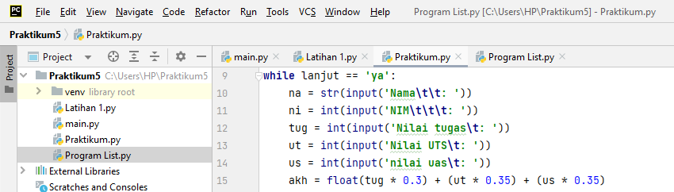

4. Kode program untuk proses perhitungan pada nilai akhir yang di ambil dari tugas 30%, uts 35% dan uas 35%, jika ditulis dalam kode program menjadi : - akhir=(tugas0.3)+(uts0.35)+(uas*0.35) lalu kita akan gunakan perintah append() agar nanti nilai yang di inputkan bisa masuk kedalam variabel list yang tadi sudah kita buat: - nama.append(na) - nim.append(ni) - tugas.append(tug) - uts.append(ut) - uas.append(us) - akhir.append(akh)

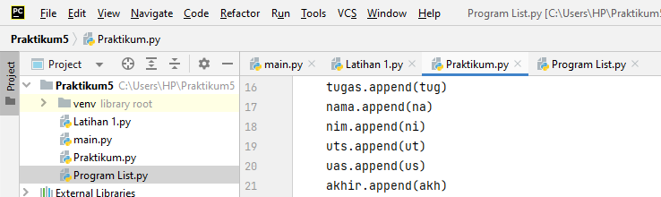

5. kita juga menggunakan operator assigment pada variabel no, yang berfungsi agar nanti menjadi batas atau range pada perulangan for - no+=1

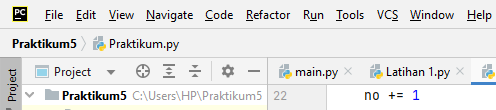

6. terakhir kita input 'lanjut (ya/tidak)? tadi sudah kita bahas soal fungsi lanjut ini yakni untuk mengulangi perulangan while, jika 'ya' maka akan melanjutkan perulangan nya tetapi, jika selain 'ya' maka perulangan akan berhenti.

7. Menampilkan atau output dari program yang sudah kita buat disini kita menggunakan perulangan for

- for i in range(no) print(nama[i], nim[i], tugas[i], uts[i], uas[i], akhir[i]) di output an ini kalian bebas berkreasi agar tampilan lebih menarik.

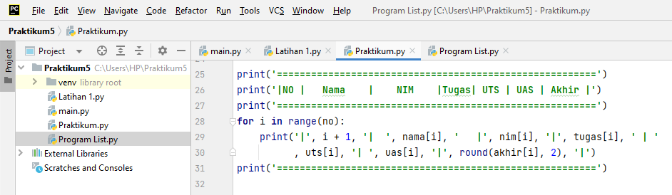

- Contoh program nya adalah sebagai berikut :

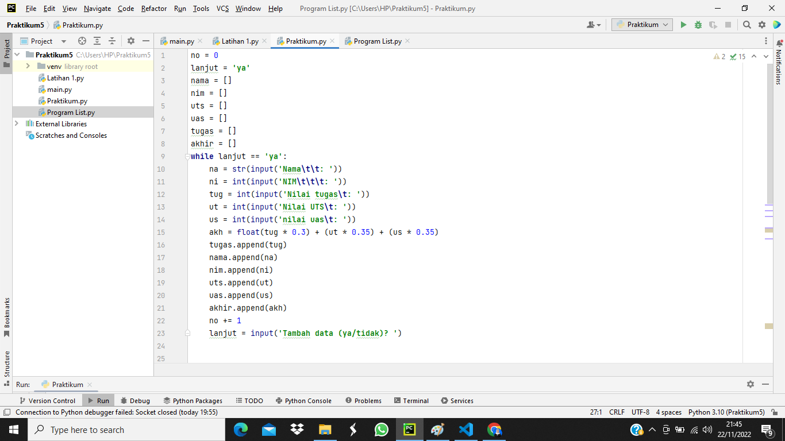

- Hasil dari program yang sudah dijalankan :

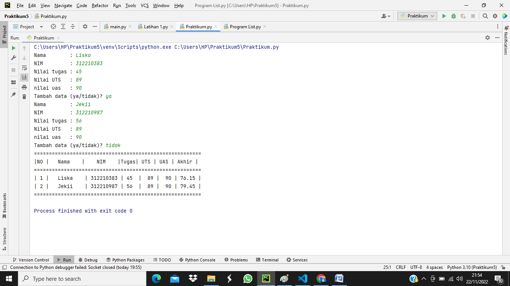

- Flowchart dari program yang sudah dijalankan :
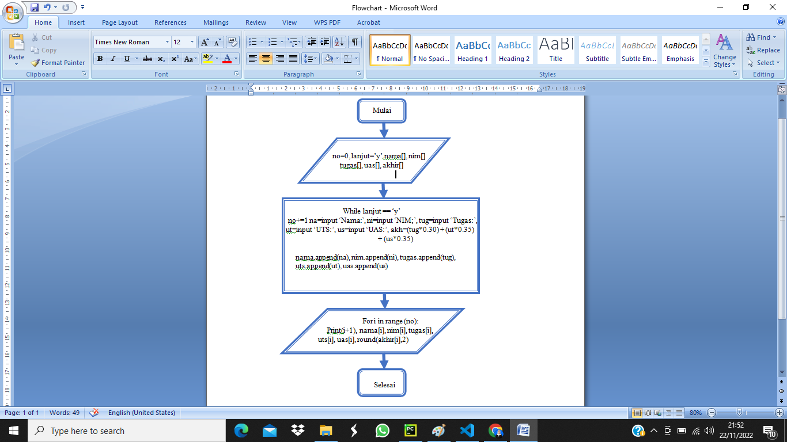